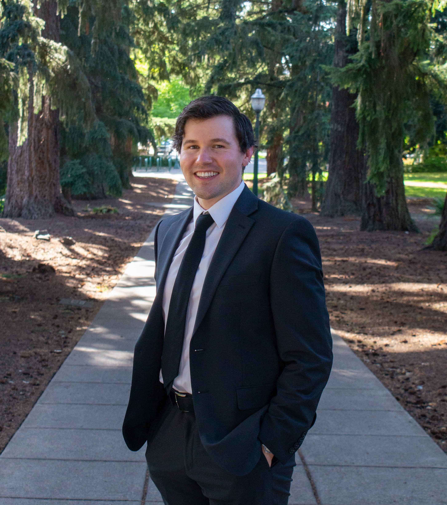

I am a Research Assistant Professor in the Institute of Social and Economic Research at the University of Alaska&mdash;Anchorage. My recent research has been on the effect of pension generosity on the labor market; understanding the impact of affirmative action for workers with a disability; and the impact of retaliation law on firm dynamics. I aim to answer these questions using empirical methods, however I also employ theoretical models to better understand real world phenomena. Research interests outside of this include: selection into motorcycling, wildfires, and the impact of political regimes. Please feel free to email me at: <a style = "color: #2b3742" href = "mailto: bmwilson12@alaska.edu">bmwilson12@alaska.edu</a>

Outside of academia, you can find me cooking, camping, traveling, or reading/writing contemporary fiction/poetry.

